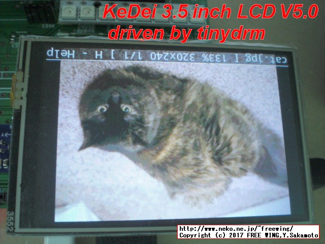
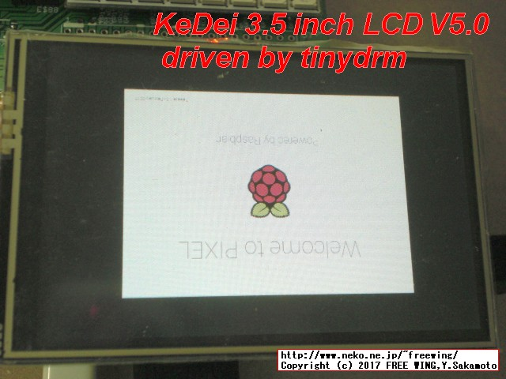

```html:tite

Original text from
 KeDei 3.5 inch 480x320 TFT lcd from ali
 https://www.raspberrypi.org/forums/viewtopic.php?f=44&t=124961&start=175
 by notro - Fri Mar 24, 2017 3:52 am - Step-by-step and some more:

 notro/tinydrm - Out-of-tree tinydrm modules
 https://github.com/notro/tinydrm/


KeDei 3.5inch LCD V5.0 module for tinydrm Raspberry Pi
Modified by FREE WING, Y.Sakamoto
http://www.neko.ne.jp/~freewing/

FREEWING-JP/tinydrm - forked from notro/tinydrm
https://github.com/FREEWING-JP/tinydrm/tree/feature/kedei_35_v50
--------------------------------
```
---
## KeDei version V5.0 only 

 This program works only with KeDei 3.5 inch TFT LCD module V 5.0.  
 Other versions will not work except V1.0 and V2.0 .  
  
 keidei_v10 = may be work ?  
 keidei_v20 = may be work ?  
 keidei_v50 = work confirmed by FREE WING  

---
## Other Resources

#### Orange Pi PC 2 Allwinner H5 FBTFT fbflex 3.5 inch TFT LCD module SPI Control program
https://github.com/FREEWING-JP/OrangePi_PC2_FBTFT_fbflex_35_lcd  

#### Raspberry Pi FBTFT fbflex 3.5 inch TFT LCD module SPI Control program
https://github.com/FREEWING-JP/RaspberryPi_FBTFT_fbflex_35_lcd  

#### Raspberry Pi KeDei 3.5 inch TFT LCD module V5.0 SPI Control program
https://github.com/FREEWING-JP/RaspberryPi_KeDei_35_lcd_v50  

#### tinydrm for KeDei 3.5 inch V5.0 LCD module
https://github.com/FREEWING-JP/tinydrm/tree/feature/kedei_35_v50/kedei_35_lcd_v50  


```html:body

# ========
# ========
# Check Raspbian version
uname -a
# Linux raspberrypi 4.4.50-v7+ #970 SMP Mon Feb 20 19:18:29 GMT 2017 armv7l GNU/Linux

# ====
# install tinydrm kernel with headers
sudo REPO_URI=https://github.com/notro/rpi-firmware BRANCH=tinydrm rpi-update

# *** If no errors appeared, your firmware was successfully updated to fc4ad383a059a38cae39815dcef0210663d7147f
# *** A reboot is needed to activate the new firmware

sudo reboot


# ========
# ========
# Check Raspbian version
uname -a
# Linux raspberrypi 4.10.4-v7+ #1 SMP Wed Mar 22 13:05:23 CET 2017 armv7l GNU/Linux


# ====
# if you want me to pull your changes, fork this repo and use your fork instead
cd
## git clone https://github.com/notro/tinydrm
git clone -b feature/kedei_35_v50 https://github.com/FREEWING-JP/tinydrm.git
cd ~/tinydrm/
make

sudo make install && sudo depmod

# ====
# KeDei V5.0
sudo dtc -@ -I dts -O dtb -o /boot/overlays/keidei50.dtbo rpi-overlays/keidei50-overlay.dts

# Warning (unit_address_vs_reg):

# ====
# for DEBUG Log
sudo nano /boot/cmdline.txt
# drm.debug=0xf

# ====
# KeDei V5.0
sudo nano /boot/config.txt
# dtoverlay=keidei50

# ====
sudo reboot


# ========
# ========
ls -al /dev/fb*

sudo apt-get update
sudo apt-get install -y fbi
wget https://github.com/adafruit/Adafruit_Python_ILI9341/raw/master/examples/cat.jpg
sudo fbi -d /dev/fb1 -T 1 -a cat.jpg

# ====
sudo vcdbg log msg 2>&1 | grep keidei
# 002167.799: Loaded overlay 'keidei50'

# ====
cat /proc/device-tree/soc/spi@7e204000/keidei@0/compatible && echo
# keidei,keidei_v50

# ====
cat /sys/bus/spi/devices/spi0.0/modalias
# spi:keidei_v50

# ====
modinfo keidei

# ====
# picked only the relevant modules
lsmod | grep keidei

# ====
# only relevant parts
dmesg | grep keidei

# ====
# clear log
sudo dmesg -C

# ====
# one second of console output will flood the log with the detailed logging in keidei20_write()
# so remove it when it looks ok
con2fbmap 1 1 && sleep 1 && con2fbmap 1 0
dmesg | wc -l
# 2046


# ====
sudo nano /boot/cmdline.txt
# fbcon=map:1

# ====
sudo reboot


# ========
# ========
# no need to reboot or reinstall modules to test a driver change
#  if the depending modules are loaded
# but 'make install' is necessary to load the correct version on boot
cd ~/tinydrm/
make
sudo rmmod keidei
sudo insmod keidei.ko

```

---
## Picture






